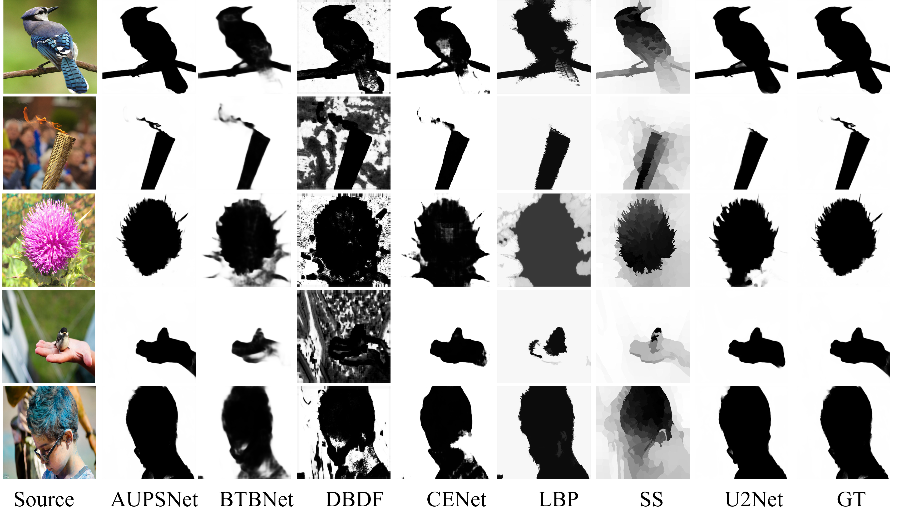
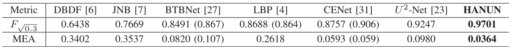

# Heterogeneous Attention Nested U-Shaped Network for Blur Detection

**Author**: Wenliang Guo, Xiao Xiao *, Yilong Hui , Wenming Yang , and Amir Sadovnik

## Abstract 

With the popularity of image sensors in various mobile devices, image blurring caused by hand shaking or out of focus becomes ubiquitous, which deteriorates image quality and poses challenges for vision tasks, including object detection, image classification and image segmentation. Designing an efficient blur detection algorithm which can automatically detect and locate blurred regions becomes necessary. In this letter, we design an end-to-end convolution neural network called heterogeneous attention nested U-shaped network (HANUN) for blur detection. We introduce pyramid pooling into encoders to enhance the feature extraction at different scales and reduce the gradual information loss. Inspired by the nested network design, small U-shaped networks are embedded into our decoders to increase the network depth and promote feature fusion with different receptive field scales. In addition, we incorporate a channel attention mechanism in the proposed network to highlight the informative features for detecting the blurry regions. Experimental results show that HANUN outperforms other state-of-the-art algorithms for blur detection tasks on public datasets and real-world images.

## Overall Architecture

## Demo

## Experimental Results

1. Precision-Recall curve

2. Comparsion with SOTA networks.

3. Ablation study.

