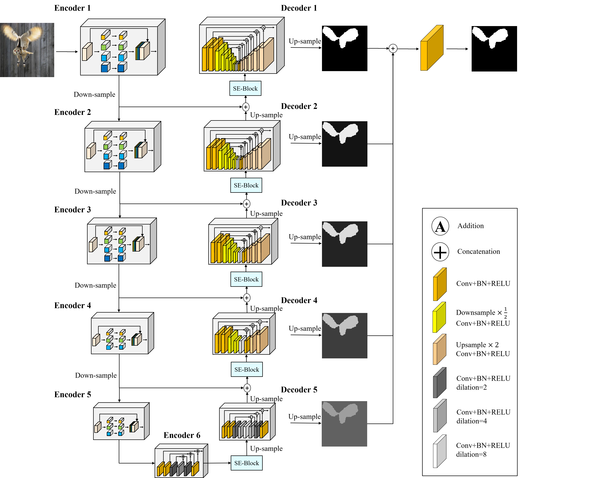
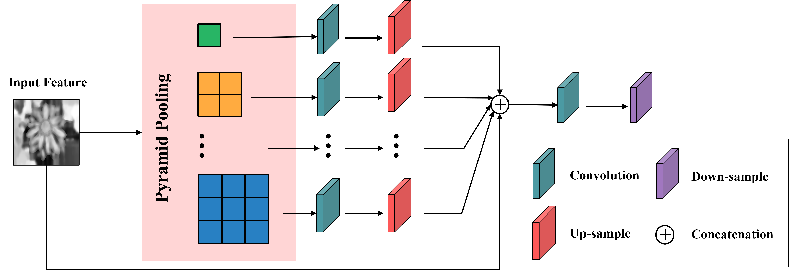

# AUPSNet (Attention U-shaped Pyramid Segmentation Network)

The code for our paper **AUPSNet (Attention U-shaped Pyramid Segmentation Network)** 
## Architecture

## Pyramid Pooling Encoder

## Attention Nested U-Net Decoder

## Results

## P-R Curve

