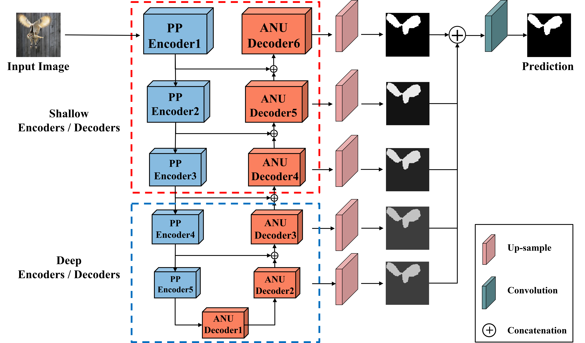
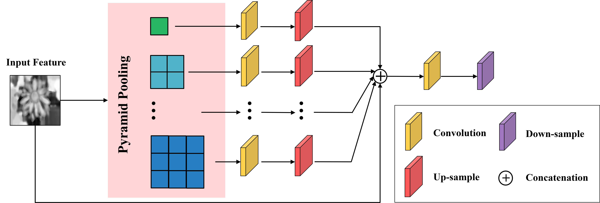
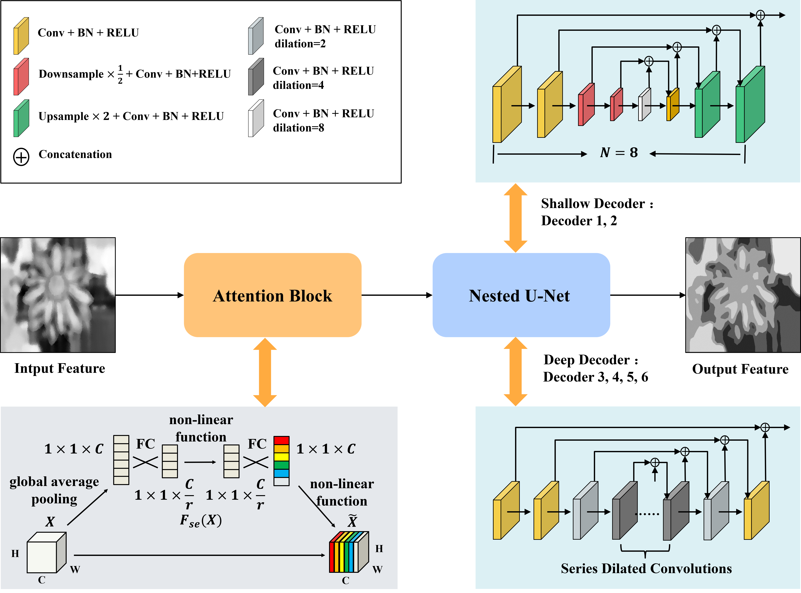

# HANUN (Attention U-shaped Pyramid Segmentation Network)

**Abstract**: As image sensors are becoming more and more popular in various mobile devices, image blur caused by hand shake or defocusing becomes ubiquitous. It can reduce image quality and bring challenges to subsequent vision tasks, including target detection, image classification, and segmentation. An efficient blur detection algorithm, which automatically detects and locates blurred regions, is the first step and the key for blurring image processing. In this paper, we design an end-to-end convolution neural network called heterogeneous attention nested U-shaped network (HANUN) for blur detection. HANUN is based on a heterogeneous U-shaped architecture with specially designed encoders and decoders. In encoder stages, We introduce a pyramid pooling to enhance the feature extraction at different scales and reduce the information loss due to series convolutions. In decoder stages, we nest small U-shaped networks to increase the network depth and promote feature fusion with different receptive field scales. Besides, an attention mechanism is used in decoder stages to highlight the important features for the network performance. The heterogeneous and nest design of encoder and decoder can obviously improve encoding and decoding effectiveness compared with other U-shaped networks. Experimental results show that HANUN outperforms other state-of-the-art (SOTA) algorithms for blur detection tasks on public datasets. Meanwhile, our proposed model has achieved the best detection accuracy level on the real images from mobile telephone image sensors even without pre-extracting features. 

**Author**: Wenliang Guo, Xiao Xiao

## Overall Architecture

## Pyramid Pooling Encoder

## Attention Nested U-Net Decoder

## Results

## P-R Curve on CUHK dataset

